# Android Development: Unit 1 - Part 1
## Foundations of Android Development 📱

## Table of Contents for Complete Unit 1
### Part 1: Foundations (Current Document)
- Java Fundamentals for Android
- Overview of Android
- Development Environment Setup

### Part 2: Building Blocks
- Activities, Fragments, and Intents
- Creating User Interfaces
- Basic Android Components

### Part 3: Advanced Concepts
- Android Resources
- App Widgets
- Best Practices & Common Patterns

## 1. Java Fundamentals for Android 📚

### 1.1 Understanding Object-Oriented Programming (OOP)

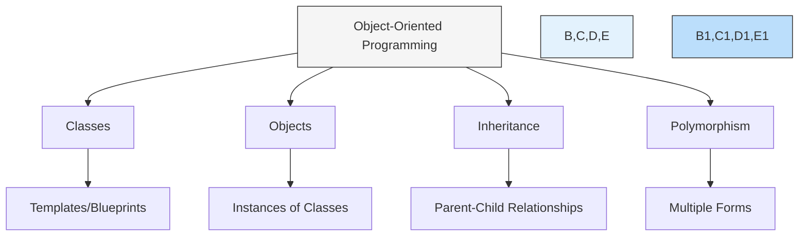

#### Classes and Objects Explained
A class is like a blueprint, and an object is something built from that blueprint.

```java
// This is a class - think of it as a blueprint for a car
public class Car {
    // Properties (what the car has)
    private String brand;
    private String color;
    private int speed;

    // Constructor (how to build the car)
    public Car(String brand, String color) {
        this.brand = brand;
        this.color = color;
        this.speed = 0;  // Initial speed is 0
    }

    // Methods (what the car can do)
    public void accelerate() {
        speed += 10;
        System.out.println(color + " " + brand + " is going " + speed + " mph");
    }

    public void brake() {
        speed = 0;
        System.out.println(color + " " + brand + " has stopped");
    }
}

// This creates an actual car (object) from our blueprint
Car myCar = new Car("Toyota", "Red");
myCar.accelerate();  // Red Toyota is going 10 mph
myCar.brake();       // Red Toyota has stopped
```

### 1.2 Essential Java Concepts for Android

#### Variables and Data Types

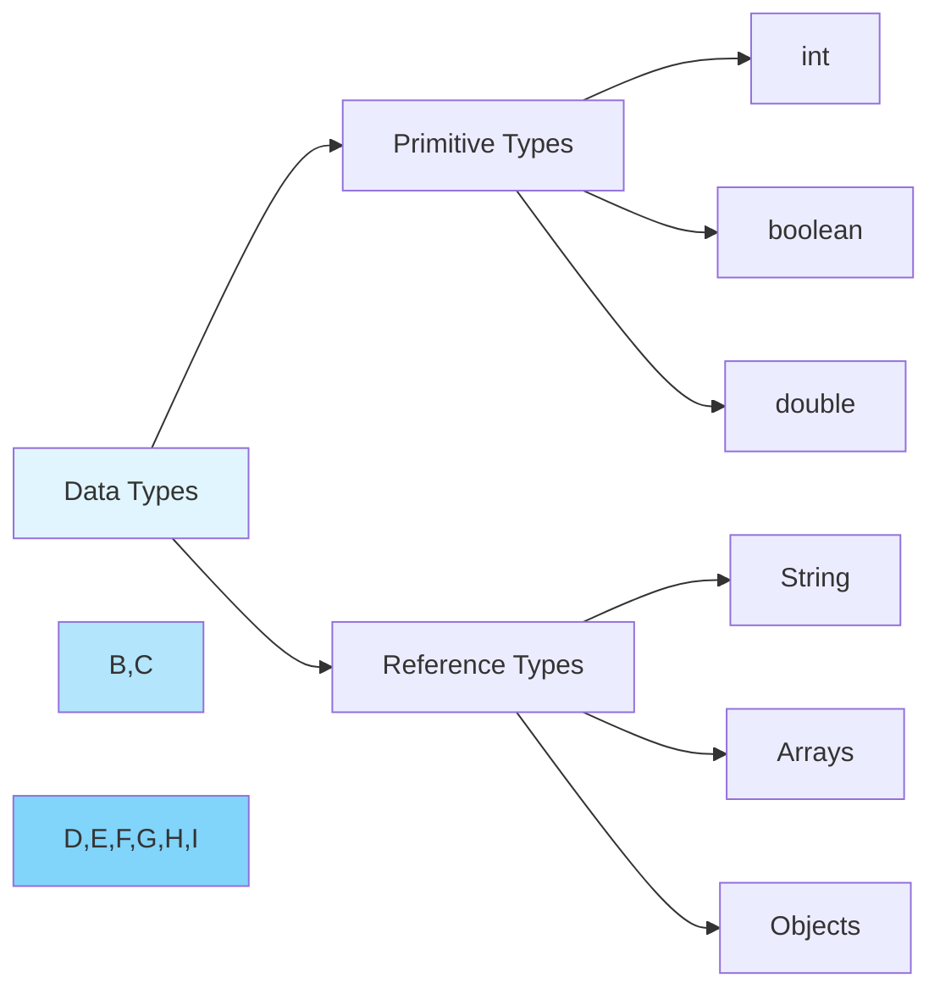

```java
// Primitive Types (simple data)
int age = 25;                  // Whole numbers
double price = 19.99;          // Decimal numbers
boolean isStudent = true;      // true/false values
char grade = 'A';              // Single characters

// Reference Types (complex data)
String name = "John Doe";      // Text
int[] scores = {90, 85, 95};   // Array of numbers
List<String> names = new ArrayList<>();  // List of strings
```

#### Methods and Functions
Methods are actions that your code can perform:

```java
// Method anatomy explained
public void showMessage(String message) {
    //   ↑    ↑     ↑         ↑
    //   1    2     3         4
    
    // 1: Access modifier (who can use this method)
    // 2: Return type (what kind of data it gives back)
    // 3: Method name (what we call it)
    // 4: Parameters (what information it needs)
    
    System.out.println(message);
}

// Method with return value
public int addNumbers(int a, int b) {
    return a + b;  // Gives back the sum
}
```

### 1.3 Android-Specific Java Features

#### Context
Context is like a gateway to Android features:

```java
// Using context to show a message
Context context = getApplicationContext();
Toast.makeText(context, "Hello Android!", Toast.LENGTH_SHORT).show();

// Using context to get resources
Resources res = context.getResources();
String appName = res.getString(R.string.app_name);
```

## 2. Overview of Android Platform 🤖

### 2.1 Android Architecture

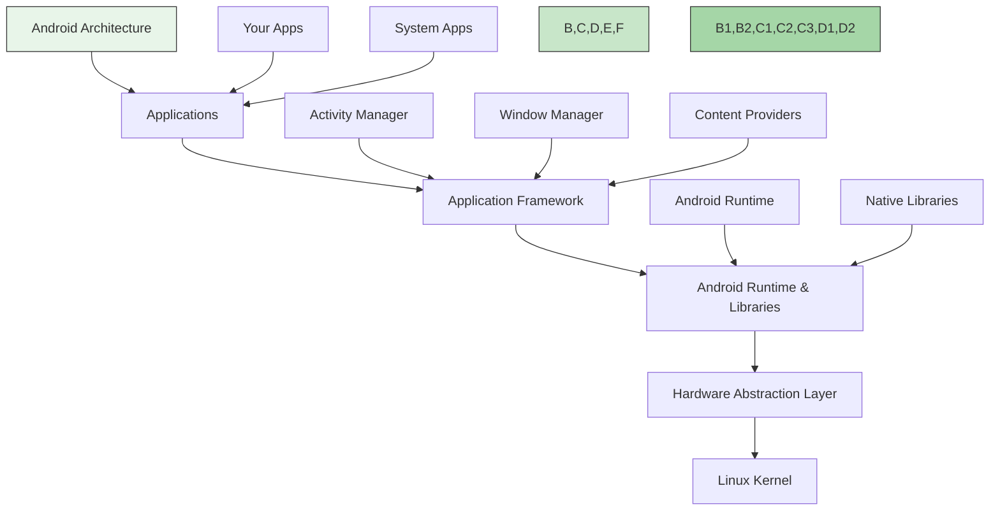

### 2.2 Android Components Explained

#### Activities
An Activity represents one screen in your app:

```java
public class MainActivity extends AppCompatActivity {
    @Override
    protected void onCreate(Bundle savedInstanceState) {
        super.onCreate(savedInstanceState);
        // This links your activity to its layout
        setContentView(R.layout.activity_main);
        
        // Now you can interact with your UI elements
        Button myButton = findViewById(R.id.myButton);
        myButton.setOnClickListener(view -> {
            // Code to run when button is clicked
            Toast.makeText(this, "Button Clicked!", 
                         Toast.LENGTH_SHORT).show();
        });
    }
}
```

## 3. Development Environment Setup 🛠️

### 3.1 Required Tools

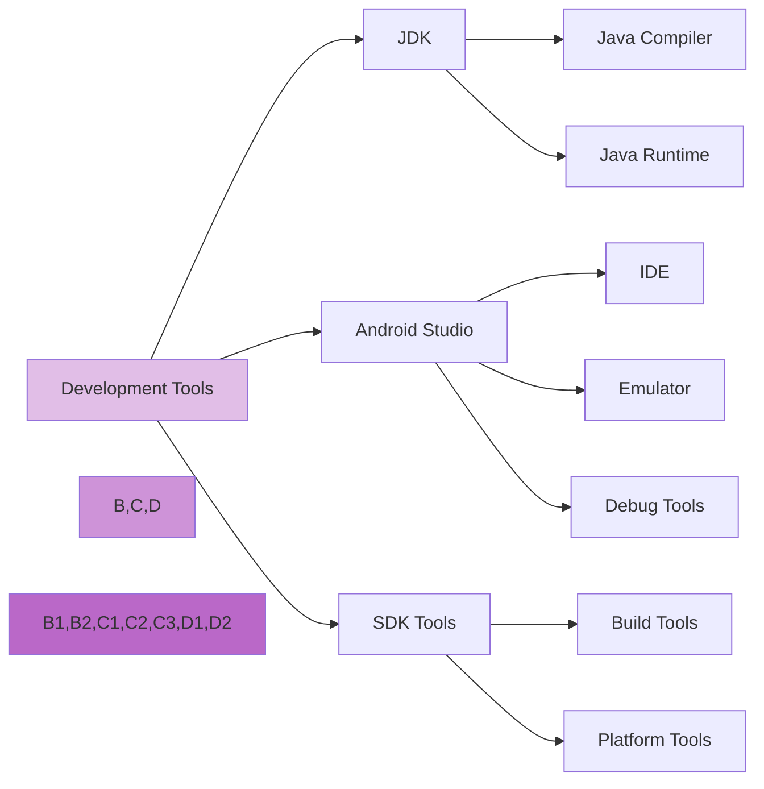

### 3.2 Android Studio Interface

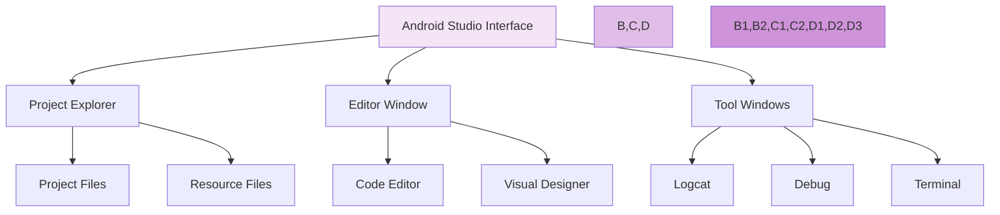

### 3.3 Project Structure
A typical Android project structure:

```
MyApp/
├── app/
│   ├── manifests/
│   │   └── AndroidManifest.xml
│   ├── java/
│   │   └── com.example.myapp/
│   │       └── MainActivity.java
│   └── res/
│       ├── layout/
│       │   └── activity_main.xml
│       ├── values/
│       │   ├── strings.xml
│       │   └── colors.xml
│       └── drawable/
│           └── icon.png
└── gradle/
    └── build.gradle
```

# Android Development: Unit 1 - Part 2
## Building Blocks of Android Applications 🏗️

## 4. Activities, Fragments, and Intents

### 4.1 Understanding Activities 📱

An Activity is a single screen in your app. Think of it like a page in a book.

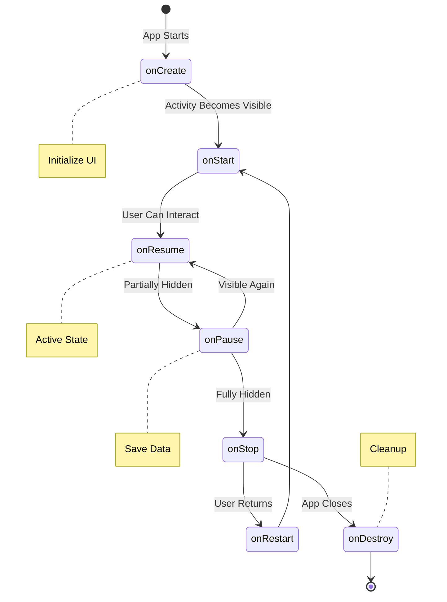

#### Basic Activity Example:
```java
public class SimpleActivity extends AppCompatActivity {
    // Step 1: Declare variables for UI elements
    private TextView messageText;
    private Button clickButton;
    private int clickCount = 0;

    @Override
    protected void onCreate(Bundle savedInstanceState) {
        // Step 2: Basic setup
        super.onCreate(savedInstanceState);
        setContentView(R.layout.activity_simple);

        // Step 3: Find our UI elements
        messageText = findViewById(R.id.messageText);     // Find TextView
        clickButton = findViewById(R.id.clickButton);     // Find Button

        // Step 4: Set up button click behavior
        clickButton.setOnClickListener(new View.OnClickListener() {
            @Override
            public void onClick(View v) {
                clickCount++;  // Increase counter
                updateDisplay();  // Update screen
            }
        });

        // Step 5: Restore saved state if any
        if (savedInstanceState != null) {
            clickCount = savedInstanceState.getInt("clickCount", 0);
            updateDisplay();
        }
    }

    // Helper method to update the display
    private void updateDisplay() {
        String message = "Clicked " + clickCount + " times";
        messageText.setText(message);
    }

    // Save state when activity might be destroyed
    @Override
    protected void onSaveInstanceState(Bundle outState) {
        super.onSaveInstanceState(outState);
        outState.putInt("clickCount", clickCount);
    }
}
```

Corresponding layout (activity_simple.xml):
```xml
<?xml version="1.0" encoding="utf-8"?>
<LinearLayout
    xmlns:android="http://schemas.android.com/apk/res/android"
    android:layout_width="match_parent"
    android:layout_height="match_parent"
    android:orientation="vertical"
    android:gravity="center"
    android:padding="16dp">

    <TextView
        android:id="@+id/messageText"
        android:layout_width="wrap_content"
        android:layout_height="wrap_content"
        android:text="Click the button!"
        android:textSize="20sp"
        android:layout_marginBottom="16dp"/>

    <Button
        android:id="@+id/clickButton"
        android:layout_width="wrap_content"
        android:layout_height="wrap_content"
        android:text="Click Me"/>

</LinearLayout>
```

### 4.2 Understanding Fragments 🧩

Fragments are like mini-activities that can be reused across different screens.

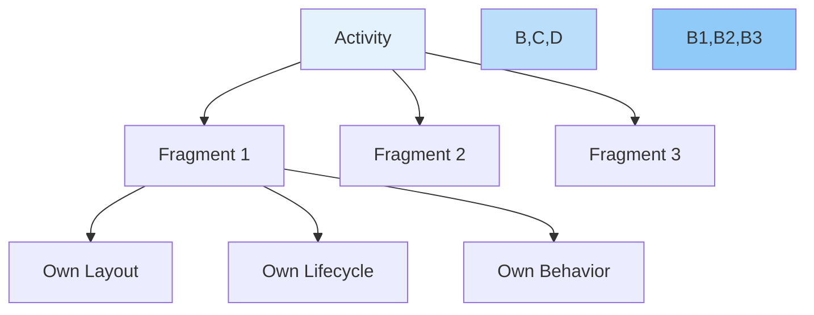

#### Simple Fragment Example:
```java
public class SimpleFragment extends Fragment {
    private TextView fragmentText;
    private Button fragmentButton;

    @Override
    public View onCreateView(LayoutInflater inflater, 
                           ViewGroup container,
                           Bundle savedInstanceState) {
        // Inflate the fragment layout
        View view = inflater.inflate(
            R.layout.fragment_simple, 
            container, 
            false
        );

        // Find our views
        fragmentText = view.findViewById(R.id.fragmentText);
        fragmentButton = view.findViewById(R.id.fragmentButton);

        // Set up button click
        fragmentButton.setOnClickListener(new View.OnClickListener() {
            @Override
            public void onClick(View v) {
                fragmentText.setText("Button clicked in fragment!");
            }
        });

        return view;
    }
}
```

### 4.3 Understanding Intents 🔄

Intents are messages that tell Android to do something.

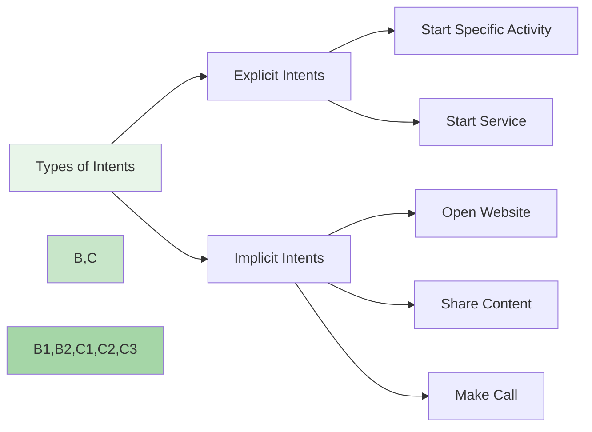

#### Intent Examples:
```java
// Example 1: Explicit Intent (going to specific screen)
Intent explicitIntent = new Intent(this, SecondActivity.class);
explicitIntent.putExtra("message", "Hello from first screen!");
startActivity(explicitIntent);

// Example 2: Implicit Intent (opening website)
Intent implicitIntent = new Intent(Intent.ACTION_VIEW);
implicitIntent.setData(Uri.parse("https://www.google.com"));
startActivity(implicitIntent);

// Example 3: Sharing text
Intent shareIntent = new Intent(Intent.ACTION_SEND);
shareIntent.setType("text/plain");
shareIntent.putExtra(Intent.EXTRA_TEXT, "Check out this app!");
startActivity(Intent.createChooser(shareIntent, "Share via"));
```

## 5. Creating User Interface

### 5.1 Basic UI Components 🎨

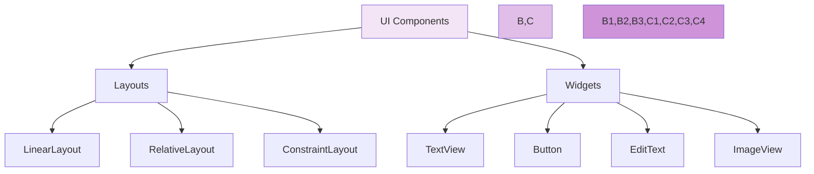

#### Common Layout Types:

1. **LinearLayout**: Arranges items in a line
```xml
<LinearLayout
    android:layout_width="match_parent"
    android:layout_height="wrap_content"
    android:orientation="vertical">
    
    <TextView
        android:layout_width="wrap_content"
        android:layout_height="wrap_content"
        android:text="First Item"/>
    
    <TextView
        android:layout_width="wrap_content"
        android:layout_height="wrap_content"
        android:text="Second Item"/>
</LinearLayout>
```

2. **RelativeLayout**: Positions items relative to each other
```xml
<RelativeLayout
    android:layout_width="match_parent"
    android:layout_height="match_parent">
    
    <Button
        android:id="@+id/centerButton"
        android:layout_width="wrap_content"
        android:layout_height="wrap_content"
        android:layout_centerInParent="true"
        android:text="Center"/>
    
    <Button
        android:layout_width="wrap_content"
        android:layout_height="wrap_content"
        android:layout_below="@id/centerButton"
        android:layout_centerHorizontal="true"
        android:text="Below Center"/>
</RelativeLayout>
```

### 5.2 Creating Interactive UI

```java
public class InteractiveActivity extends AppCompatActivity {
    private EditText inputField;
    private Button submitButton;
    private TextView resultText;

    @Override
    protected void onCreate(Bundle savedInstanceState) {
        super.onCreate(savedInstanceState);
        setContentView(R.layout.activity_interactive);

        // Find views
        inputField = findViewById(R.id.inputField);
        submitButton = findViewById(R.id.submitButton);
        resultText = findViewById(R.id.resultText);

        // Set up button click
        submitButton.setOnClickListener(new View.OnClickListener() {
            @Override
            public void onClick(View v) {
                // Get input text
                String userInput = inputField.getText().toString();
                
                // Show input in result
                if (!userInput.isEmpty()) {
                    resultText.setText("You entered: " + userInput);
                    inputField.setText("");  // Clear input
                } else {
                    // Show error if input is empty
                    inputField.setError("Please enter some text");
                }
            }
        });
    }
}
```

Corresponding layout:
```xml
<?xml version="1.0" encoding="utf-8"?>
<LinearLayout
    xmlns:android="http://schemas.android.com/apk/res/android"
    android:layout_width="match_parent"
    android:layout_height="match_parent"
    android:orientation="vertical"
    android:padding="16dp">

    <EditText
        android:id="@+id/inputField"
        android:layout_width="match_parent"
        android:layout_height="wrap_content"
        android:hint="Enter your text here"
        android:padding="8dp"
        android:layout_marginBottom="16dp"/>

    <Button
        android:id="@+id/submitButton"
        android:layout_width="wrap_content"
        android:layout_height="wrap_content"
        android:text="Submit"
        android:layout_gravity="center_horizontal"
        android:layout_marginBottom="16dp"/>

    <TextView
        android:id="@+id/resultText"
        android:layout_width="wrap_content"
        android:layout_height="wrap_content"
        android:layout_gravity="center_horizontal"
        android:textSize="18sp"/>

</LinearLayout>
```

# Android Development: Unit 1 - Part 3
## Resources, Widgets, and Best Practices 📱

## 6. Understanding Android Resources 📦

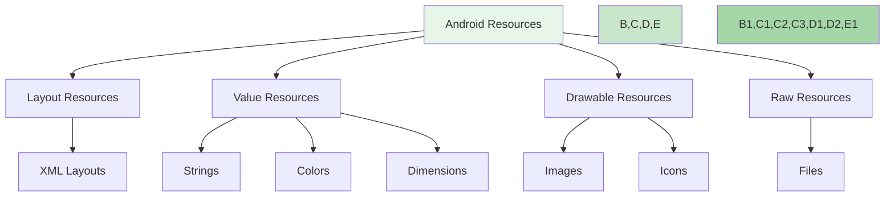

### 6.1 Resource Types and Usage

#### 1. String Resources (strings.xml)
```xml
<?xml version="1.0" encoding="utf-8"?>
<resources>
    <!-- Basic strings -->
    <string name="app_name">My App</string>
    <string name="welcome_message">Welcome to my app!</string>
    
    <!-- String with formatting -->
    <string name="greeting">Hello, %1$s!</string>
    
    <!-- String array -->
    <string-array name="planets">
        <item>Mercury</item>
        <item>Venus</item>
        <item>Earth</item>
    </string-array>
</resources>
```

Using strings in Java:
```java
// Simple string
String appName = getString(R.string.app_name);

// Formatted string
String greeting = getString(R.string.greeting, userName);

// String array
String[] planets = getResources().getStringArray(R.array.planets);
```

#### 2. Color Resources (colors.xml)
```xml
<?xml version="1.0" encoding="utf-8"?>
<resources>
    <color name="primary">#2196F3</color>
    <color name="secondary">#FFC107</color>
    <color name="text_color">#212121</color>
    <color name="background">#FFFFFF</color>
</resources>
```

Using colors:
```java
// In Java
int colorPrimary = getResources().getColor(R.color.primary);
view.setBackgroundColor(colorPrimary);

// In XML
android:textColor="@color/text_color"
android:background="@color/background"
```

#### 3. Dimension Resources (dimens.xml)
```xml
<?xml version="1.0" encoding="utf-8"?>
<resources>
    <dimen name="text_small">12sp</dimen>
    <dimen name="text_normal">16sp</dimen>
    <dimen name="text_large">20sp</dimen>
    <dimen name="padding_standard">16dp</dimen>
</resources>
```

### 6.2 Working with Resources Example

```java
public class ResourceDemoActivity extends AppCompatActivity {
    @Override
    protected void onCreate(Bundle savedInstanceState) {
        super.onCreate(savedInstanceState);
        setContentView(R.layout.activity_resource_demo);

        // Finding views
        TextView welcomeText = findViewById(R.id.welcomeText);
        Button colorButton = findViewById(R.id.colorButton);
        LinearLayout mainLayout = findViewById(R.id.mainLayout);

        // Using string resource with formatting
        String userName = "John";
        String welcome = getString(R.string.greeting, userName);
        welcomeText.setText(welcome);

        // Using color resources
        colorButton.setOnClickListener(new View.OnClickListener() {
            @Override
            public void onClick(View v) {
                // Toggle between two colors
                int newColor = getResources().getColor(
                    mainLayout.getTag() != null ? 
                    R.color.primary : R.color.secondary
                );
                
                mainLayout.setBackgroundColor(newColor);
                mainLayout.setTag(newColor);
            }
        });
    }
}
```

Layout file (activity_resource_demo.xml):
```xml
<?xml version="1.0" encoding="utf-8"?>
<LinearLayout
    android:id="@+id/mainLayout"
    xmlns:android="http://schemas.android.com/apk/res/android"
    android:layout_width="match_parent"
    android:layout_height="match_parent"
    android:orientation="vertical"
    android:padding="@dimen/padding_standard">

    <TextView
        android:id="@+id/welcomeText"
        android:layout_width="wrap_content"
        android:layout_height="wrap_content"
        android:textSize="@dimen/text_large"
        android:textColor="@color/text_color"
        android:layout_marginBottom="@dimen/padding_standard"/>

    <Button
        android:id="@+id/colorButton"
        android:layout_width="wrap_content"
        android:layout_height="wrap_content"
        android:text="@string/change_color"
        android:layout_gravity="center"/>

</LinearLayout>
```

## 7. App Widgets 🔲

### 7.1 Understanding App Widgets

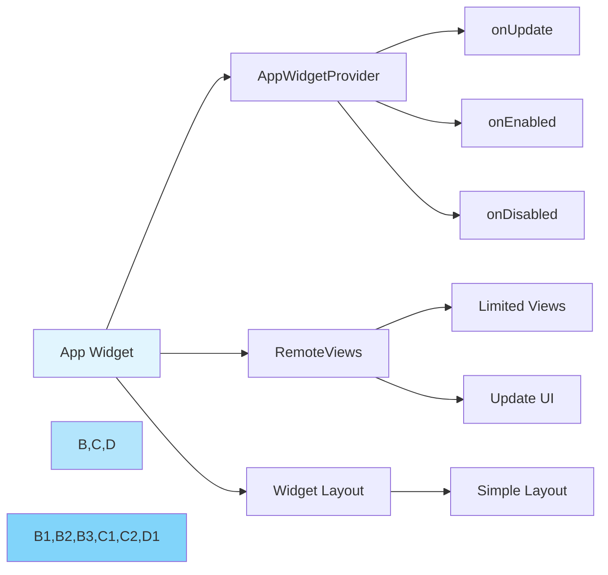

### 7.2 Creating a Simple Widget

1. Widget Layout (widget_layout.xml):
```xml
<?xml version="1.0" encoding="utf-8"?>
<LinearLayout
    xmlns:android="http://schemas.android.com/apk/res/android"
    android:layout_width="match_parent"
    android:layout_height="wrap_content"
    android:orientation="vertical"
    android:padding="8dp"
    android:background="#FFFFFF">

    <TextView
        android:id="@+id/widget_title"
        android:layout_width="wrap_content"
        android:layout_height="wrap_content"
        android:textStyle="bold"
        android:textSize="16sp"
        android:text="My Widget"/>

    <TextView
        android:id="@+id/widget_text"
        android:layout_width="wrap_content"
        android:layout_height="wrap_content"
        android:layout_marginTop="4dp"
        android:text="Loading..."/>

</LinearLayout>
```

2. Widget Provider Class:
```java
public class SimpleWidget extends AppWidgetProvider {
    
    @Override
    public void onUpdate(Context context, 
                        AppWidgetManager appWidgetManager,
                        int[] appWidgetIds) {
        // Update each widget instance
        for (int widgetId : appWidgetIds) {
            updateWidget(context, appWidgetManager, widgetId);
        }
    }

    private void updateWidget(Context context, 
                            AppWidgetManager appWidgetManager,
                            int widgetId) {
        // Create RemoteViews object
        RemoteViews views = new RemoteViews(
            context.getPackageName(),
            R.layout.widget_layout
        );

        // Update the text
        String currentTime = new SimpleDateFormat("HH:mm")
            .format(new Date());
        views.setTextViewText(
            R.id.widget_text,
            "Last updated: " + currentTime
        );

        // Create pending intent for widget click
        Intent intent = new Intent(context, MainActivity.class);
        PendingIntent pendingIntent = PendingIntent.getActivity(
            context, 0, intent, 
            PendingIntent.FLAG_UPDATE_CURRENT
        );
        views.setOnClickPendingIntent(
            R.layout.widget_layout, 
            pendingIntent
        );

        // Update the widget
        appWidgetManager.updateAppWidget(widgetId, views);
    }
}
```

3. Widget Info (appwidget-provider.xml):
```xml
<?xml version="1.0" encoding="utf-8"?>
<appwidget-provider
    xmlns:android="http://schemas.android.com/apk/res/android"
    android:minWidth="40dp"
    android:minHeight="40dp"
    android:updatePeriodMillis="1800000"
    android:initialLayout="@layout/widget_layout"
    android:resizeMode="horizontal|vertical"
    android:widgetCategory="home_screen">
</appwidget-provider>
```

### 7.3 Best Practices for Android Development 🎯

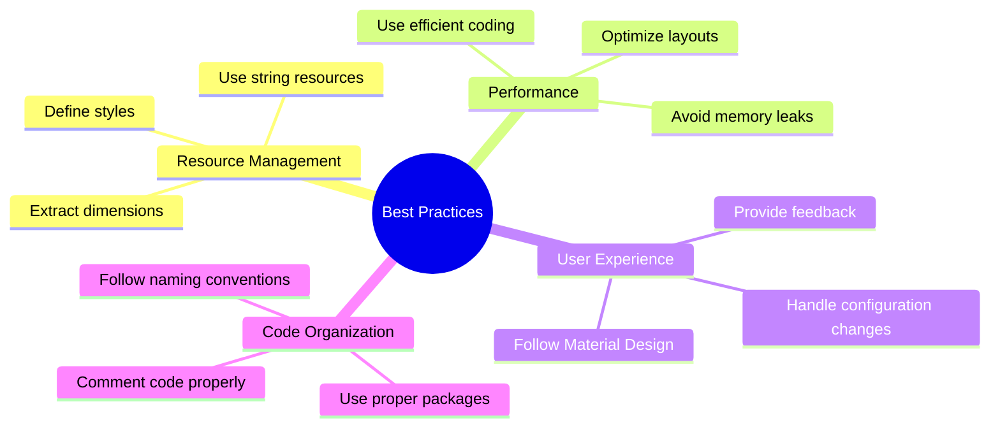

#### 1. Resource Management
```java
// BAD: Hardcoding strings
textView.setText("Hello World");

// GOOD: Using string resources
textView.setText(R.string.hello_world);
```

#### 2. Memory Management
```java
// BAD: Possible memory leak
private static Context context;

// GOOD: Use WeakReference if needed
private WeakReference<Context> contextRef;
```

#### 3. Layout Optimization
```xml
<!-- BAD: Nested layouts -->
<LinearLayout>
    <LinearLayout>
        <LinearLayout>
            <!-- Views -->
        </LinearLayout>
    </LinearLayout>
</LinearLayout>

<!-- GOOD: Flat hierarchy -->
<ConstraintLayout>
    <!-- Views with constraints -->
</ConstraintLayout>
```

### 🎯 Practice Exercise

Create a simple weather widget that:
1. Shows current temperature
2. Updates every 30 minutes
3. Opens weather activity on click

Solution outline:
```java
public class WeatherWidget extends AppWidgetProvider {
    @Override
    public void onUpdate(Context context, 
                        AppWidgetManager appWidgetManager,
                        int[] appWidgetIds) {
        // Update weather info
        for (int widgetId : appWidgetIds) {
            updateWeather(context, appWidgetManager, widgetId);
        }
    }

    private void updateWeather(Context context,
                             AppWidgetManager appWidgetManager,
                             int widgetId) {
        RemoteViews views = new RemoteViews(
            context.getPackageName(),
            R.layout.weather_widget
        );
        
        // Update temperature (mock data for example)
        views.setTextViewText(
            R.id.temperature_text,
            "25°C"
        );
        
        // Set click action
        Intent intent = new Intent(context, WeatherActivity.class);
        PendingIntent pendingIntent = PendingIntent.getActivity(
            context, 0, intent, 
            PendingIntent.FLAG_UPDATE_CURRENT
        );
        views.setOnClickPendingIntent(
            R.id.widget_layout,
            pendingIntent
        );
        
        // Update widget
        appWidgetManager.updateAppWidget(widgetId, views);
    }
}
```

## 📝 Summary of Unit 1

1. Java Fundamentals
   - OOP concepts
   - Variables and methods
   - Android-specific features

2. Android Basics
   - Activities and their lifecycle
   - Fragments for reusable UI
   - Intents for communication

3. User Interface
   - Layouts and views
   - Resource management
   - Widget development

## 🔍 Next Steps
- Practice creating different types of layouts
- Experiment with various Android resources
- Build simple widgets
- Follow Android best practices in your projects
