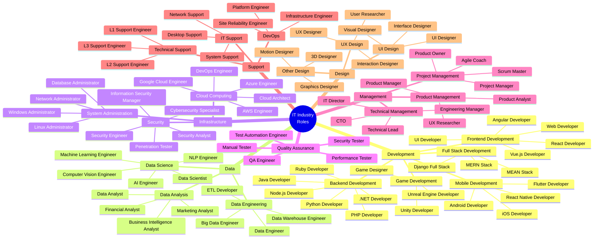

```mermaid
mindmap
  root((IT Industry
    Roles))
    Development
        Frontend Development
            React Developer
            Angular Developer
            Vue.js Developer
            UI Developer
            Web Developer
        Backend Development
            Python Developer
            Java Developer
            Node.js Developer
            PHP Developer
            .NET Developer
            Ruby Developer
        Full Stack Development
            MEAN Stack
            MERN Stack
            Django Full Stack
        Mobile Development
            iOS Developer
            Android Developer
            React Native Developer
            Flutter Developer
        Game Development
            Unity Developer
            Unreal Engine Developer
            Game Designer
    Data
        Data Science
            Data Scientist
            Machine Learning Engineer
            AI Engineer
            NLP Engineer
            Computer Vision Engineer
        Data Engineering
            Data Engineer
            ETL Developer
            Data Warehouse Engineer
            Big Data Engineer
        Data Analysis
            Data Analyst
            Business Intelligence Analyst
            Financial Analyst
            Marketing Analyst
    Infrastructure
        Cloud Computing
            AWS Engineer
            Azure Engineer
            Google Cloud Engineer
            Cloud Architect
            DevOps Engineer
        System Administration
            Linux Administrator
            Windows Administrator
            Network Administrator
            Database Administrator
        Security
            Security Engineer
            Penetration Tester
            Security Analyst
            Cybersecurity Specialist
            Information Security Manager
    Quality Assurance
        QA Engineer
        Test Automation Engineer
        Performance Tester
        Security Tester
        Manual Tester
    Management
        Project Management
            Project Manager
            Scrum Master
            Agile Coach
            Product Owner
        Technical Management
            Technical Lead
            Engineering Manager
            CTO
            IT Director
        Product Management
            Product Manager
            Product Analyst
            UX Researcher
    Support
        Technical Support
            L1 Support Engineer
            L2 Support Engineer
            L3 Support Engineer
        DevOps
            Site Reliability Engineer
            Infrastructure Engineer
            Platform Engineer
        IT Support
            Desktop Support
            Network Support
            System Support
    Design
        UX Design
            UX Designer
            Interaction Designer
            User Researcher
        UI Design
            UI Designer
            Visual Designer
            Interface Designer
        Other Design
            Graphics Designer
            Motion Designer
            3D Designer
```
